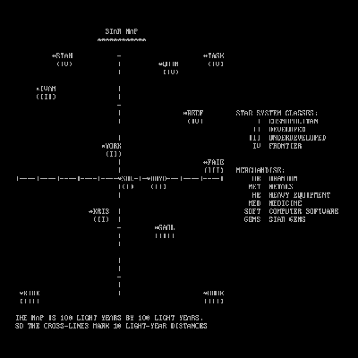
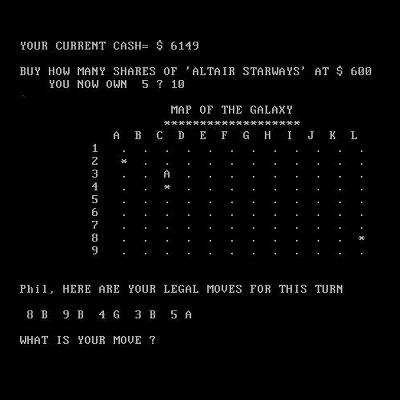

# Clojure Star-Lanes

*A Nostalgic Implementation*


[![Build Status][travis-badge]][travis][![Dependencies Status][deps-badge]][deps][![Clojars Project][clojars-badge]][clojars]

[![starlanes open source project logo][starlanes-logo]][starlanes-logo-large]


#### Contents

* [Background](#usage-)
  * [Star Trader](#star trader-)
  * [Star Lanes](#star-lanes-)
* [Clojure Implementation](#clojure-implementation-)
* [Dependencies](#dependencies-)
* [Usage](#usage-)
* [License](#license-)


## Background [&#x219F;](#contents)

*Star Trader* was a BASIC game written by Dave Kaufman and published by the
"People's Computer Company" in 1974. Despite that publication date, though,
it actually seems to have been written in 1973 (based on scaps of information
gathered when researching the game's origins).

Over the years, it was copied and then heavily modified, morphing into what
became *Star Lanes* by the late 70s and early 80s. (Note that some *Star Lanes*
versions of the game still used the `TRADE.BAS` filename, while others
switched to `LANES.BAS`.)

The *Star Trader* lineage of games inspired a list of excellent games; the
[Wikipedia article](https://en.wikipedia.org/wiki/Star_Trader) even claims
that EVE Online traces its ancestry to *Star Trader*. There is also a page
that provides a [timeline](http://wiki.classictw.com/index.php?title=Inside_TradeWars_-_History_-_Timeline)
of *Star Trader*, should you want to explore this further.

The differences of the original two varieties of the game are briefly
outlined below.


### Star Trader [&#x219F;](#contents)



In *Star Trader*, players travel about the star map buying and selling six types
of merchandise: uranium, metals, gems, software, heavy equipment, and medicine.


### Star Lanes [&#x219F;](#contents)



In *Star Lanes*, players take turns building outposts, creating companies, and
purchasing stock.


## Clojure Implementation [&#x219F;](#contents)

This Clojure implementation follows the *Star Lanes* path, since that's the one
that I played as a kid on a CP\M Kaypro II back in '81. It does, however,
provide for a more diverse game play than the original, with an extended map
and greater number of companies (both configurable).


## Dependencies [&#x219F;](#contents)

You will need to have Java, Clojure, and Leiningen installed. `lein` will
need to be in your `$PATH`. Also, note that running most of the `make` targets
for the first time will download all the dependencies automatically, so you will
see lots of text scrolling in your terminal while it does so.


## Usage [&#x219F;](#contents)

Instructions for play are provided in-game (copying the text of the original
almost word-for-word).

The easiest way to play the game is simply this:

```
$ git clone https://github.com/oubiwann/clj-starlanes.git
$ cd clj-starlanes
$ make run-jar-standalone
```

Enjoy!


## License [&#x219F;](#contents)

In honor of the old BSD games, this codebase is licensed under the BSD 3-clause license.


<!-- Named page links below: /-->

[travis]: https://travis-ci.org/clojusc/clj-starlanes
[travis-badge]: https://travis-ci.org/clojusc/clj-starlanes.png?branch=master
[deps]: http://jarkeeper.com/clojusc/clj-starlanes
[deps-badge]: http://jarkeeper.com/clojusc/clj-starlanes/status.svg
[starlanes-logo]: https://raw.githubusercontent.com/clojusc/clj-starlanes/master/resources/screeshots/hy-early-stage-game-400.png
[starlanes-logo-large]: https://raw.githubusercontent.com/clojusc/clj-starlanes/master/resources/screeshots/hy-early-stage-game-400.png
[clojars]: https://clojars.org/starlanes
[clojars-badge]: https://img.shields.io/clojars/v/starlanes.svg
[tag-badge]: https://img.shields.io/github/tag/clojusc/clj-starlanes.svg?maxAge=2592000
[tag]: https://github.com/clojusc/clj-starlanes/tags
